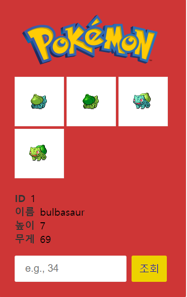

pokedex_api

* Component List
- App
- Info
- Input
- Main

* CSS 
styled-components

* 작업내역
- https://pokeapi.co/ 에서 포켓몬 정보 API 통신
- ID 숫자 입력 > '조회' 클릭시 해당 ID api 통신 후 값 리턴
- ID, 이름, 높이, 무게, 이미지 노출
- input 박스 입력 형태 유도 하도록 placeholder 노출
- 사용자가 입력한 숫자가 없는 ID일 경우 다른 숫자 입력하도록 alert 노출
- 유효성 검사
  - 0 입력 > '조회' 클릭시 다른 숫자 입력하도록 alert 노출
  - 미입력 > '조회' 클릭시 숫자 입력하도록 alert 노출
  - 정규식 사용하여 숫자 외 입력 > '조회' 클릭시 숫자만 입력하도록 alert 노출 